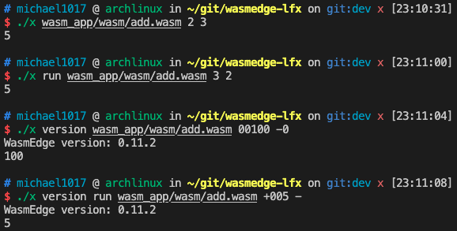
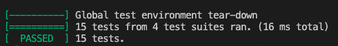

# LFX Mentorship 2023

## Description

LFX Mentorship 2023 01-Mar-May Challenge - WasmEdge

## Getting Started

### Dependency
  
For Basic Install:

* Clang
* GNU Make
* WasmEdge Library

For Testing:  
Need to fulfill the basic install requirement, then install the following tools:

* Clang++
* llvm
* Google Test

### Installation

#### Docker Install
The project builds the latest master branch image and publish it on [docker hub](https://hub.docker.com/r/mike1017/lfx_mentorship_2023/tags). The image contains compiled project binary called `x`.

Pull the image from docker hub:

```bash
docker pull mike1017/lfx_mentorship_2023:latest
```

Execute the binary in container.

```bash
docker run --rm -it mike1017/lfx_mentorship_2023 ./x version
docker run --rm -it mike1017/lfx_mentorship_2023 ./x wasm_app/wasm/add.wasm 1 2
docker run --rm -it mike1017/lfx_mentorship_2023 ./x version wasm_app/wasm/add.wasm 1 2
```


#### Source Install 

The project uses GNU Make system to build the source. Several things can be configured before starting to build. To learn more detail about configuration, please check [customize Makefile](docs/customize_makefile.md)

For Basic Install: 
By default, it will generate a execution file called `x`. To change the default execution name, please check [customize Makefile](docs/customize_makefile.md)

```bash
make all
```

Clean up object files and executions produced by `make all` and `make test`

```bash
make clean
```

### Execution

```
./x [version] [run] [wasm path] [arguments]
`./x` is the default execution name.  
`version` print WasmEdge version
`run` is optional; expect the following arguments are `wasm path` and `arguments`.  
`wasm path` is required; the relative or absolute path of wasm app.  
`arguments` is optional; support i32, i64, f32 and f64 input.
```

Example:

```bash
./x wasm_app/wasm/add.wasm 2 3 
./x run wasm_app/wasm/add.wasm 3 2 
./x version wasm_app/wasm/add.wasm 00100 -0
./x version run wasm_app/wasm/add.wasm +005 - 
```



### Testing

#### Run Google Test

By default, it will generate a execution file called `x_testall`. To change the default execution name, please check [customize Makefile](docs/customize_makefile.md). The testing may print some error messages, this is because the test includes illegal test cases to check its error handling ability. Developers only need to check if "PASSED" is printed at the end of the tests.

```bash
make test
./x_testall
```

The "PASSED" message should be like this:


Clean up object files and executions produced by `make test`

```bash
make clean_test
```

#### Run Clang Source-Based Code Coverage

```bash
sh coverage_test.sh
```

The report should be like this:


## Implementation Report

This section shows how I implemented the tool and provides screenshots of execution results.

* [How To Add New Options](docs/add_option.md)
* [Launch Wasm Use WasmEdge C SDK](docs/launch_wasm.md)
* [Screenshots of Execution Results](./docs/execution_results.md)
* [Project Manual](https://michael1017.github.io/LFX_Mentorship_2023/doxygen/html/files.html)

## Reference

* [WasmEdge](https://github.com/WasmEdge/WasmEdge)
* [WasmEdge C SDK](https://wasmedge.org/book/en/sdk/c.html)
* [GoogleTest](http://google.github.io/googletest)
* [Clang Source-Based Code Coverage](https://clang.llvm.org/docs/SourceBasedCodeCoverage.html)
