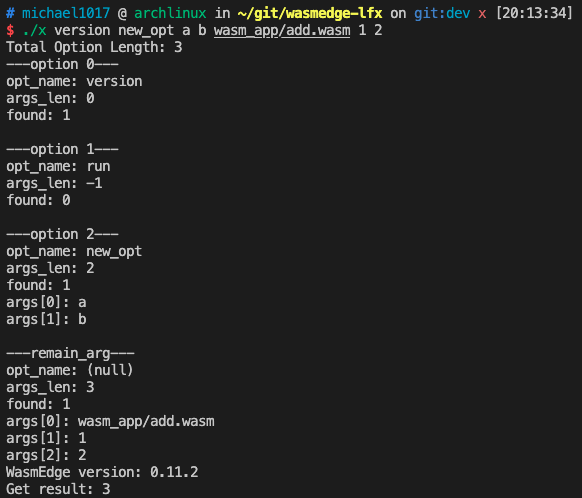

# How To Add New Options

## Introduction

To add new options, there are three main steps:

1. Define Options
2. Pass Argument Parsing
3. Handle Options

By following the steps, programmer can:

1. easily add new options
2. create handlers for different options independently

This is the main function of the program, I will use it as an example in the following sections.

```cc
int main(const int argc, const char** argv) {
  ParseData* pd = create_ParseData();
  Option* define_opt[] = {
    create_Option("version", 0), 
    create_Option("run", -1)
  };
  int define_opt_len = sizeof(define_opt)/sizeof(Option*);
  
  handle_parse(pd, (Option ** )define_opt, define_opt_len, argc, argv);
  handle_option(pd);

  delete_Option_array(define_opt, define_opt_len);
  delete_ParseData(pd);
  return 0;
}
```

## Define Option

Define option tells the program which options should be handled.

In the main function, we can see a function called `create_Option` inside `define_opt` array. The first argument of the `create_Option` is option's name, and the second is expected argument length after the option. If the argument length set to `-1`, it means the option will accept all the arguments after it.

For instance, to add a new option called "new_opt" with argument length equal to two, just simply add `create_Option("new_opt", 2)` to the `define_opt` array.

```cc
Option* define_opt[] = {
    create_Option("version", 0), 
    create_Option("run", -1),
    create_Option("new_opt", 2)
};
```

The structure of Option:

```cc
typedef struct opt Option;
struct opt{
  char* opt_name;
  int args_len;
  char** args;
  bool found;
};
```

## Argument Parsing

The task of argument parsing is to find out the location of the `define_opt` in argv.

The program use `handle_parse` to take care of the task and return the result to `pd`. If the arguments are not belong to any options, be will be collected to `remain_arg`.

```cc
handle_parse(pd, (Option ** )define_opt, define_opt_len, argc, argv);
```

The structure of ParseData:

```cc
typedef struct pd ParseData;
struct pd{
  int opt_len;
  Option** opt;
  Option* remain_arg;
};
```

If the new option is correctly added to the `define_opt`, `handle_parse` should be able to get the arguments for the new option.

For instance, if we run the following command:  

```bash
./x version new_opt a b wasm_app/add.wasm 1 2
```

We can easily see that "new_opt" catches two arguments called "a" and "b". Since "run" option is not found, the arguments which should be wasm application's file path and its arguments are collected to `remain_arg`.


## Handle Options

The task of handle options is to deal with the options' arguments and the arguments not belong to any option. To get more detail, please check the `handle_option` function in [source code](../src/lib/handler.c)

For instance, if "version" option is given, it will run `handle_option_version` and print out the wasm version.

```cc
if (strcmp("version", pd->opt[i]->opt_name) == 0) {
  state = handle_option_version();
  if (state == _FAILED){
    fprintf(stderr, _ERROR_SIG "%s: handle_option_version failed\n", __func__);
    return _FAILED;
  }
}
```

To add a new option handler for "new_opt", simply add a else if statement and write your code inside of it.

```cc
else if (strcmp("new_opt", pd->opt[i]->opt_name) == 0) {
  // Write your code here.
}
```
