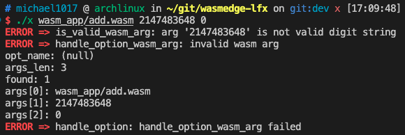

# Execution Results
## Legal Command
```
./x wasm_app/add.wasm 2 3 
./x run wasm_app/add.wasm 3 2 
./x version wasm_app/add.wasm 00100 -0
./x version run wasm_app/add.wasm +005 - 
```


## Support Different Wasm Applications
```
./x version run wasm_app/return_2023.wasm 
./x run wasm_app/add3.wasm 3 2 1000
./x version wasm_app/factorial.wasm 5
./x wasm_app/fibonacci.wasm 5
```


## Illegal Command
### Case 1
Since the `run` command expects the following arguments are `wasm path` and `arguments`, and "version" is NOT the first argument after `run`. Therefore, "version" is expected to be the `arguments`.
```
./x run wasm_app/add.wasm 3 2 version
```


### Case 2
Since the `run` command expects the following arguments are `wasm path` and `arguments`, and "version" is the first argument after `run`. Therefore, "version" is expected to be the `wasm path`.
```
./x run version wasm_app/add.wasm 3 2
```


### Case 3
Because there is no `run` command, the program expects the following arguments are `wasm path` and `arguments`. Since "version" is NOT the first argument after `run`, it is expected to be `arguments`.
```
./x wasm_app/add.wasm 2 3 version
```


### Case 4
Because `arguments` expected to be 32 bits signed int (-2^31 ~ 2^31-1), 2147483648 is not a valid input.
```
./x wasm_app/add.wasm 2147483648 0
```
