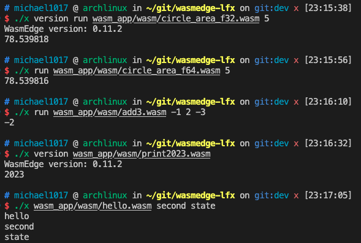
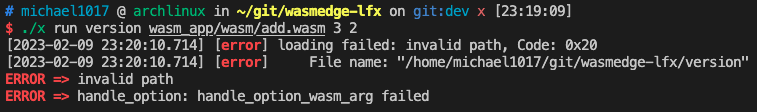
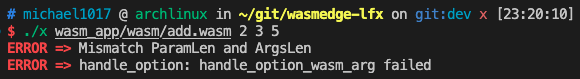

# Execution Results
## Legal Command
```
./x wasm_app/add.wasm 2 3 
./x run wasm_app/add.wasm 3 2 
./x version wasm_app/add.wasm 00100 -0
./x version run wasm_app/add.wasm +005 - 
```


## Support Different Wasm Applications
```
./x version run wasm_app/wasm/circle_area_f32.wasm 5
./x run wasm_app/wasm/circle_area_f64.wasm 5
./x run wasm_app/wasm/add3.wasm -1 2 -3
/x version wasm_app/wasm/print2023.wasm
./x wasm_app/wasm/hello.wasm second state
```


## Illegal Command
### Case 1
Since the `run` command expects the following arguments are `wasm path` and `arguments`, and "version" is NOT the first argument after `run`. Therefore, "version" is expected to be the `arguments`.
```
./x run wasm_app/wasm/add.wasm 3 2 version
```


### Case 2
Since the `run` command expects the following arguments are `wasm path` and `arguments`, and "version" is the first argument after `run`. Therefore, "version" is expected to be the `wasm path`.
```
./x run version wasm_app/wasm/add.wasm 3 2
```


### Case 3
The program will detect the number of function parameter. Since add.wasm needs only two inputs but gets three, it shows mismatch error.
```
./x wasm_app/wasm/add.wasm 2 3 5
```

